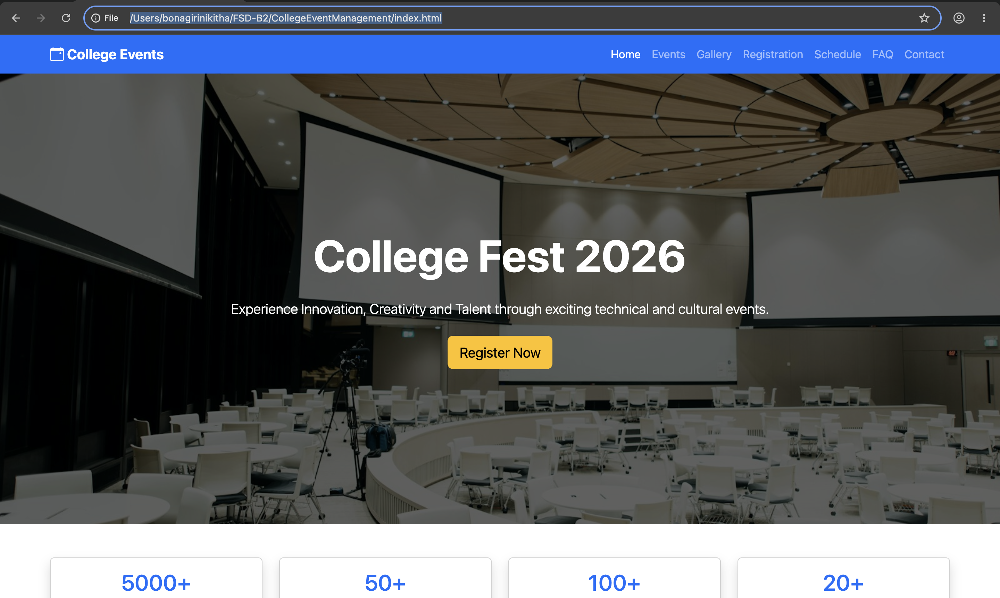
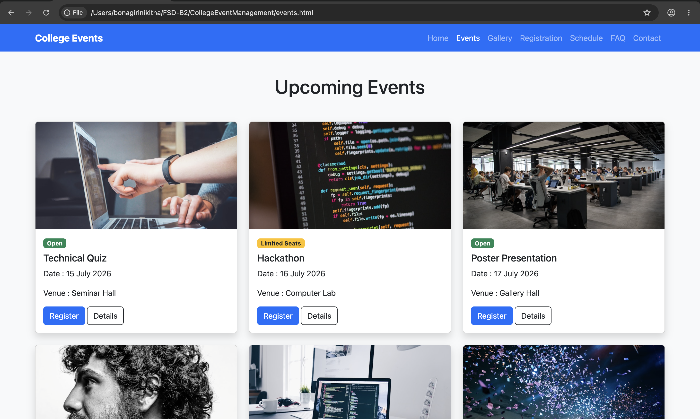
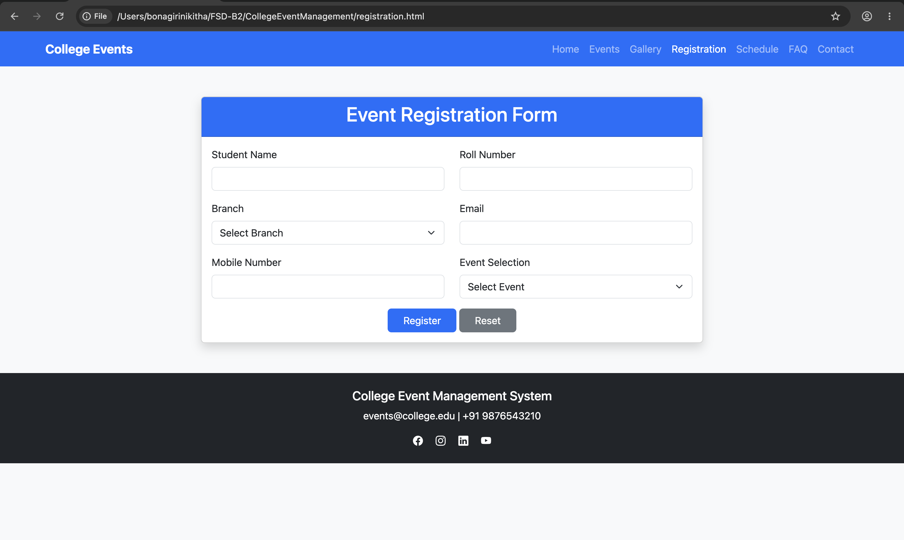
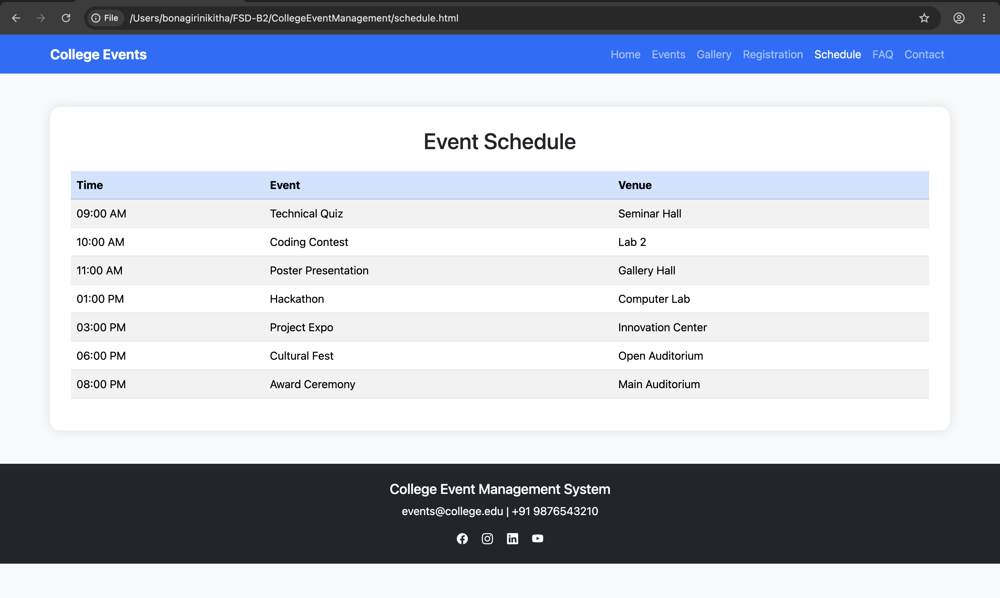
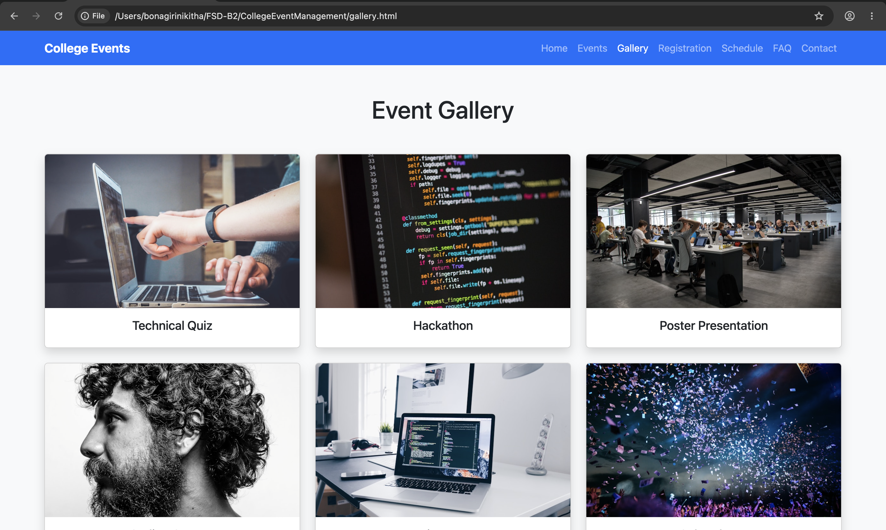
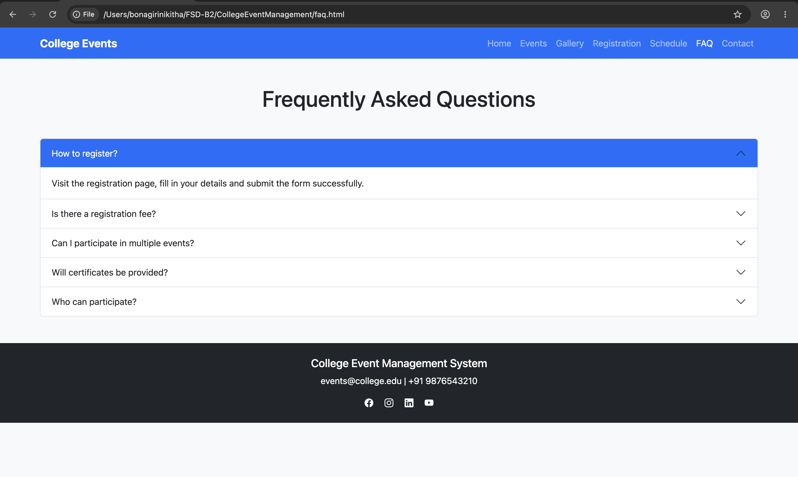
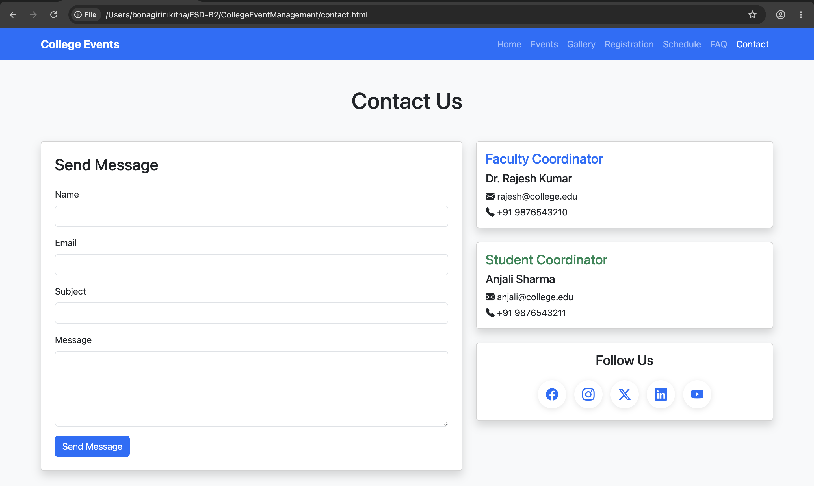

# College Event Management System

## Project Overview

The College Event Management System is a responsive web application developed using HTML5, CSS3, Bootstrap 5, and JavaScript. The system allows students to explore upcoming college events, register online, view event schedules, browse event galleries, access frequently asked questions, and contact event coordinators.

The project demonstrates the implementation of major Bootstrap components while maintaining responsive design across mobile, tablet, and desktop devices.

## Features

### Home Page

* Responsive Navigation Bar
* Hero Banner Section
* Event Highlights
* Register Now Button
* Bootstrap Carousel

### Events Page

* Six Event Cards
* Event Images
* Event Date and Venue Information
* Register Buttons
* Event Detail Modals
* Status Badges

### Registration Page

* Student Registration Form
* Branch Selection
* Event Selection
* Registration Success Alert

### Schedule Page

* Responsive Event Schedule Table
* Table Striped Layout
* Hover Effects

### Gallery Page

* Responsive Image Gallery
* Bootstrap Cards
* Grid Layout

### FAQ Page

* Frequently Asked Questions
* Bootstrap Accordion Component

### Contact Page

* Contact Form
* Faculty Coordinator Details
* Student Coordinator Details
* Social Media Links

## Technologies Used

* HTML5
* CSS3
* Bootstrap 5
* Bootstrap Icons
* JavaScript

## Bootstrap Components Used

* Navbar
* Carousel
* Cards
* Forms
* Tables
* Accordion
* Alerts
* Buttons
* Grid System
* Modal
* Badges

## Screenshots

### Home Page

### Events Page

### Registration Page

### Schedule Page

### Gallery Page

### FAQ Page

### Contact Page

## GitHub Repository Link

https://github.com/BonagiriCharan22/FSD/tree/main/CollegeEventManagement
## Project Structure

college-event-management/

├── index.html

├── events.html

├── registration.html

├── schedule.html

├── gallery.html

├── faq.html

├── contact.html

└── README.md

## Author

Developed as part of the College Event Management System project using Bootstrap 5.
