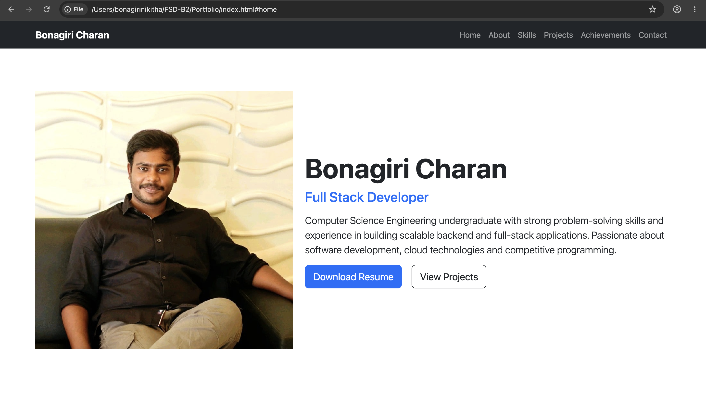
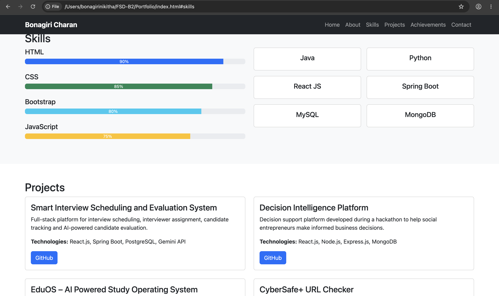
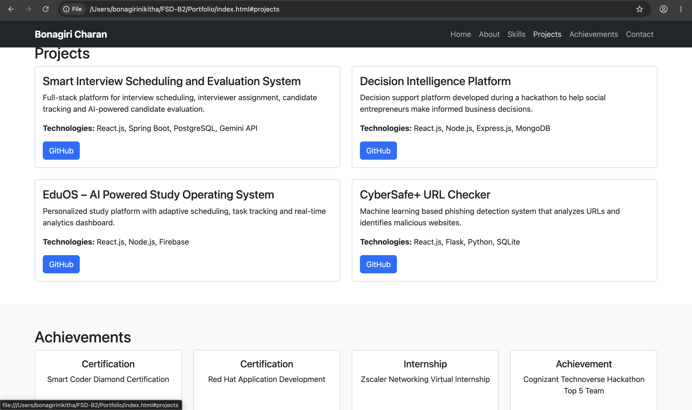
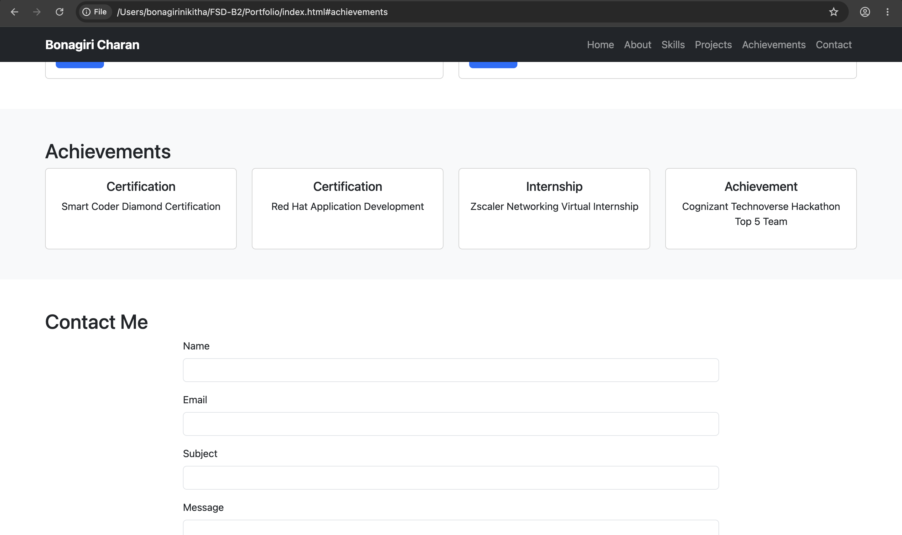
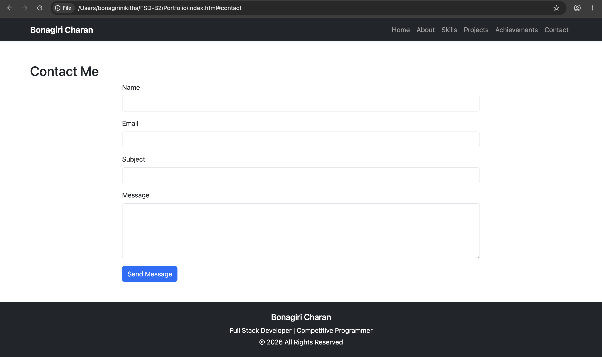

# Personal Portfolio Website

A responsive personal portfolio website developed using HTML, CSS, Bootstrap and JavaScript.

## Features

* Responsive Navigation Bar
* Home Section
* About Me Section
* Skills Section
* Projects Section
* Achievements Section
* Contact Form
* Bootstrap Modal
* Responsive Design

## Technologies Used

* HTML5
* CSS3
* Bootstrap 5
* JavaScript

## Screenshots

### Home Section



### About Section


### Skills Section



### Projects Section



### Achievements Section



### Contact Section



## Project Structure

```text
Portfolio/
│
├── index.html
├── css/
│   └── style.css
├── js/
│   └── script.js
├── images/
├── assets/
├── screenshots/
└── README.md
```

## How to Run

1. Download or clone the repository.
2. Open the project folder.
3. Open index.html in your browser.

## Author

Bonagiri Charan

Email: [bonagiricharan8517@gmail.com](mailto:bonagiricharan8517@gmail.com)

GitHub: https://github.com/BonagiriCharan22
